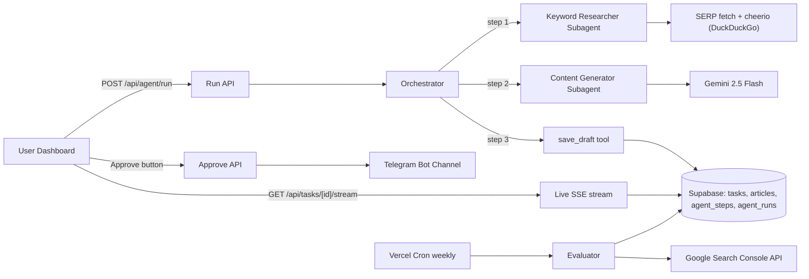
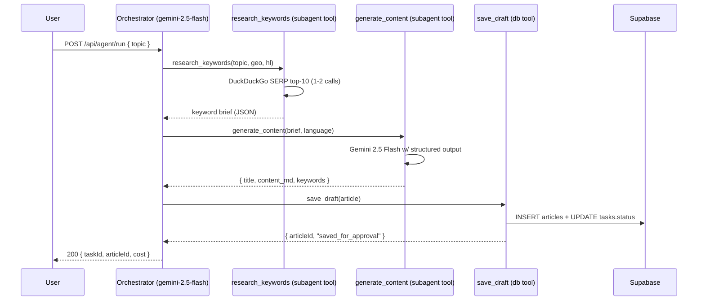
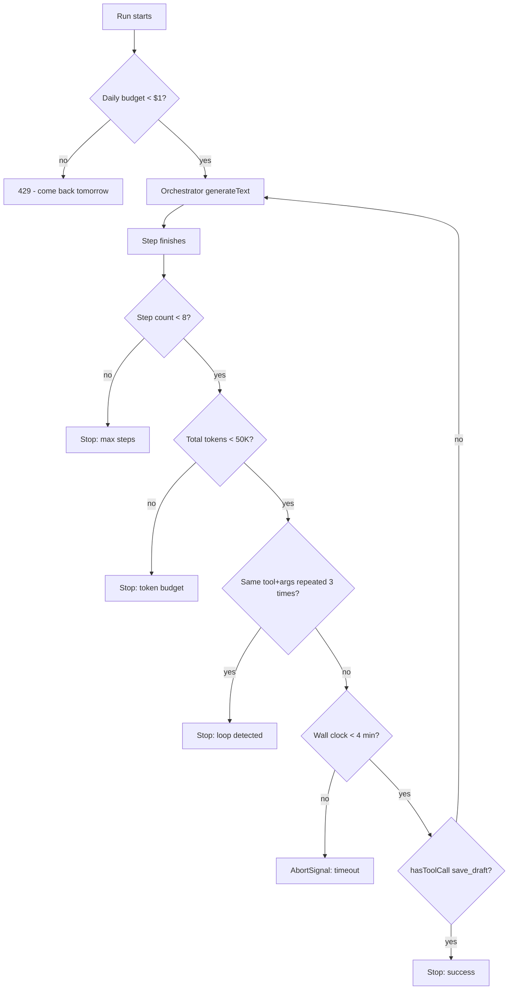
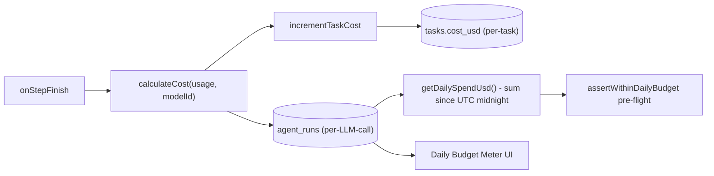
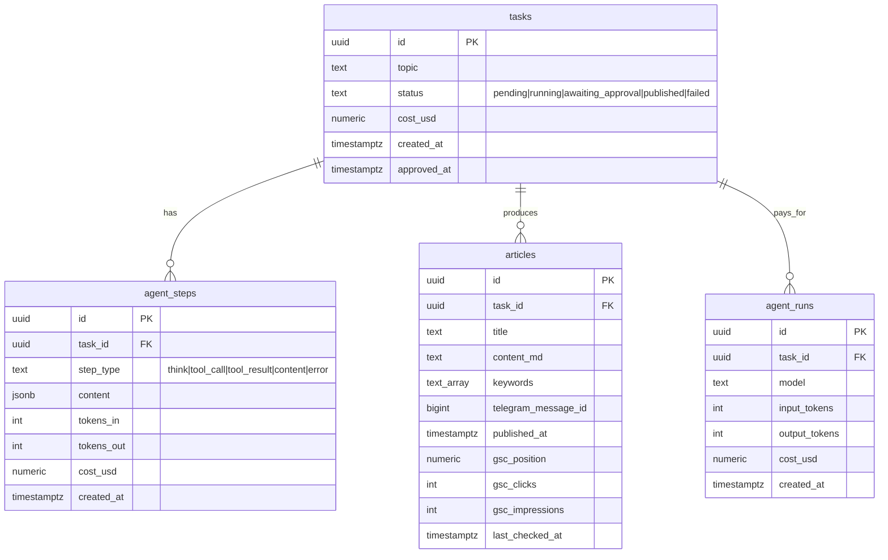
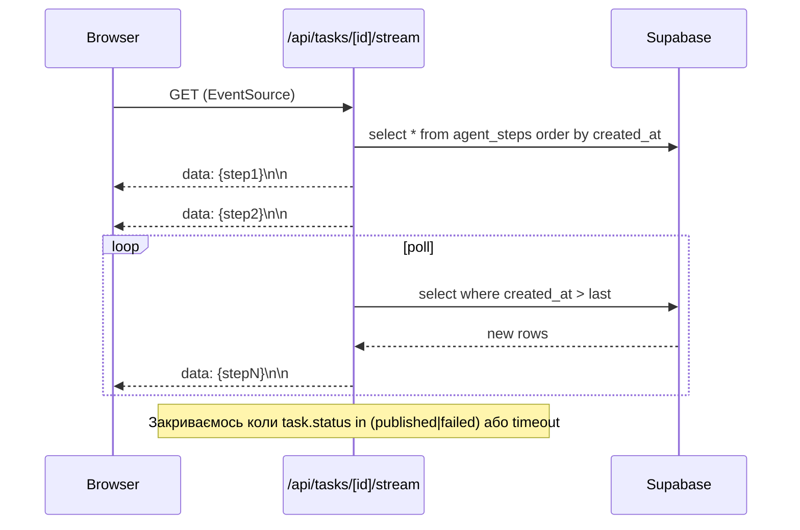

# SEO Agent Bot — Architecture

> Технічна перспектива MVP. Продуктовий контекст у [PRD.md](./PRD.md).

---

## Зміст

1. [High-level flow](#1-high-level-flow)
2. [Стек](#2-стек)
3. [Структура коду](#3-структура-коду)
4. [Оркестратор + 3 субагенти](#4-оркестратор--3-субагенти)
5. [Інструменти (tools)](#5-інструменти-tools)
6. [Гардрейли (5 рівнів)](#6-гардрейли-5-рівнів)
7. [Cost tracking](#7-cost-tracking)
8. [База даних (Supabase)](#8-база-даних-supabase)
9. [API маршрути](#9-api-маршрути)
10. [Live-стрім UI (SSE)](#10-live-стрім-ui-sse)
11. [Telegram-публікація](#11-telegram-публікація)
12. [Cron (evaluator)](#12-cron-evaluator)
13. [Технічні рішення](#13-технічні-рішення)

---

## 1. High-level flow



---

## 2. Стек

Усі версії — стабільні станом на квітень 2026:

| Шар | Технологія |
|---|---|
| Frontend / Backend | Next.js `16.2.4` (App Router, Server Components, Server Actions) |
| Runtime | React `19`, TypeScript `5+` |
| AI orchestration | Vercel AI SDK `6.x` (`ai`, `@ai-sdk/google`) |
| LLM | Gemini `2.5 Flash` через Google AI Studio |
| База | Supabase Postgres (`@supabase/ssr`, `@supabase/supabase-js`) |
| UI | Tailwind CSS `v4`, shadcn/ui, lucide-react |
| Validation | Zod `4` |
| SERP scraping | `fetch` + `cheerio` (DuckDuckGo HTML endpoint, без Playwright — Vercel Hobby обмежений) |
| Telegram | `grammy` |
| Cron | Vercel Cron (`vercel.json`) |
| Hosting | Vercel Hobby |

---

## 3. Структура коду

```
seo-agent-bot/
├── app/
│   ├── (dashboard)/                    Single-owner UI без auth
│   │   ├── layout.tsx
│   │   ├── page.tsx                    Список задач + new task form
│   │   ├── tasks/[id]/page.tsx         Live-лог + preview + Approve
│   │   └── settings/page.tsx           Поточний бюджет, ENV-стан
│   ├── api/
│   │   ├── agent/run/route.ts          POST: запускає оркестратор
│   │   ├── agent/approve/route.ts      POST: шле в Telegram + позначає published
│   │   ├── tasks/[id]/stream/route.ts  GET: SSE-стрім кроків
│   │   └── cron/weekly-check/route.ts  GET: щотижнева переоцінка (cron-only)
│   └── layout.tsx                       Root layout
├── lib/
│   ├── agents/
│   │   ├── orchestrator.ts             Головний цикл (3-крокова послідовність)
│   │   ├── keyword-researcher.ts       Субагент-дослідник
│   │   ├── content-generator.ts        Субагент-письменник
│   │   └── evaluator.ts                Cron-job: GSC → re-optimize queue
│   ├── tools/
│   │   ├── serp.ts                     fetch + cheerio парсинг DuckDuckGo топ-10
│   │   ├── gsc.ts                      Google Search Console API
│   │   └── telegram.ts                 grammy-обгортка
│   ├── api/
│   │   ├── sse.ts                      Server-Sent Events helper
│   │   └── telegram-format.ts          Markdown → MarkdownV2
│   ├── supabase/
│   │   ├── client.ts                   Browser-side anon client
│   │   └── server.ts                   createAdminClient (service role)
│   ├── cost.ts                         Pricing + tracking + daily-budget queries
│   ├── guardrails.ts                   stopWhen, loop detect, timeout
│   └── format.ts                       Date/cost formatters
├── components/
│   ├── dashboard/                       Доменні компоненти
│   │   ├── new-task-form.tsx
│   │   ├── live-task-view.tsx
│   │   ├── task-status-badge.tsx
│   │   ├── daily-budget-meter.tsx
│   │   └── dashboard-nav.tsx
│   └── ui/                              shadcn/ui примітиви
├── supabase/migrations/0001_init.sql    Схема БД + RLS
├── docs/PRD.md
├── docs/ARCHITECTURE.md                 (цей файл)
├── vercel.json                          Cron config
└── .env.example
```

---

## 4. Оркестратор + 3 субагенти

### Дизайн

Замість одного «розумного» агента ми використовуємо **оркестратор + спеціалізовані субагенти**. Кожен субагент експонується як `tool()` для оркестратора:



### Чому така ієрархія

1. **Менший контекст на крок** — кожен субагент бачить лише те, що йому потрібно. Оркестратор не несе всю SERP-інформацію крізь content generator.
2. **Структуровані інтерфейси** — Zod-схема (`articleDraftOutputSchema`) гарантує, що `save_draft` отримає валідний JSON.
3. **Один stop-сигнал** — оркестратор зупиняється, як тільки `save_draft` викликаний (`hasToolCall("save_draft")`).
4. **Спрощене тестування** — кожен субагент тестується окремо без LLM (мокаємо tools).

### System prompt оркестратора

Жорстко фіксована послідовність із трьох tool-викликів — оркестратор не має свободи імпровізувати. Деталі у [`lib/agents/orchestrator.ts`](../lib/agents/orchestrator.ts) у константі `ORCHESTRATOR_PROMPT`.

---

## 5. Інструменти (tools)

| Tool | Що робить | Файл |
|---|---|---|
| `serp_analysis` | парсить топ-10 DuckDuckGo за запитом, повертає title/url/snippet/domain | [`lib/tools/serp.ts`](../lib/tools/serp.ts) |
| `gsc_metrics` | читає Google Search Console (clicks, impressions, position) | [`lib/tools/gsc.ts`](../lib/tools/gsc.ts) |
| `publish_to_telegram` | шле статтю в канал через `grammy` | [`lib/tools/telegram.ts`](../lib/tools/telegram.ts) |
| `save_draft` (closure-bound) | INSERT в `articles` + flip task → `awaiting_approval` | [`lib/agents/orchestrator.ts`](../lib/agents/orchestrator.ts) |

> Keyword Researcher subagent повністю покладається на `serp_analysis` як єдине джерело правди. Початкова версія використовувала окремий `keyword_research` tool на базі неофіційного `google-trends-api`, але Google систематично віддає HTTP 429 / HTML-captcha на serverless та EU/UA IP, тож ми вирізали Trends повністю на користь SERP-driven research. Цей підхід також концептуально сильніший: реальний SERP — пряма ground truth для intent і competitor angle, тоді як Trends дає лише curve без context.

Усі tools мають Zod-`inputSchema` для tool calling та повертають типізовані обʼєкти. Tools, що мають побічні ефекти на гроші чи дистрибуцію (`publish_to_telegram`), викликаються **поза агентом** — лише після людського approve через `/api/agent/approve`.

---

## 6. Гардрейли (5 рівнів)

Імплементація — у [`lib/guardrails.ts`](../lib/guardrails.ts).



| # | Рівень | Як реалізовано |
|---|---|---|
| 0 | Pre-flight daily budget | `assertWithinDailyBudget()` перед запуском; читає `agent_runs` за UTC-добу |
| 1 | Step count cap | `stepCountIs(MAX_STEPS=20)`; для оркестратора `maxSteps: 8` |
| 2 | Token budget | `tokenBudgetIs(MAX_TOTAL_TOKENS=50_000)` |
| 3 | Loop detection | `detectLoop(threshold=3)`, ключ — `(toolName, stableStringify(input))` |
| 4 | Wall-clock timeout | `runTimeoutSignal(RUN_TIMEOUT_MS=4min)` → `AbortSignal` (под Hobby 300s) |
| 5 | Final-tool stop | `hasToolCall("save_draft")` → run закінчується одразу після успіху |
| (+) | Google Cloud email-alerts | 50% / 90% / 100% від $10 — поза кодом, як safety net |

Обʼєднувач — `defaultStopWhen()`. Оркестратор спред'ить його у `stopWhen:` AI SDK-овський `generateText`.

---

## 7. Cost tracking



- Pricing у [`lib/cost.ts`](../lib/cost.ts) у `GEMINI_PRICING` (input / output / cachedInput per 1M tokens).
- Cached input tokens рахуються за дешевшим тарифом.
- Точність — `numeric(10, 6)` у БД, `round6()` у коді — щоб не було `0.0000001` помилок.
- `LanguageModelUsage` із AI SDK обробляється у `calculateCost()` — підтримує і старі (`cachedInputTokens`), і нові (`inputTokenDetails.cacheReadTokens`) форми.

---

## 8. База даних (Supabase)



- **RLS увімкнено** на всіх таблицях як defense-in-depth, але **політики не створено**: весь запис йде через `SUPABASE_SERVICE_ROLE_KEY` із сервера, а `anon`-роль не повинна мати доступу.
- Індекси оптимізовані під найгарячіші запити: `tasks.status + created_at desc`, `agent_steps.task_id + created_at`, `agent_runs.created_at desc` (для daily spend).
- Міграція — [`supabase/migrations/0001_init.sql`](../supabase/migrations/0001_init.sql).

---

## 9. API маршрути

| Endpoint | Метод | Що робить |
|---|---|---|
| `/api/agent/run` | POST | Створює task, викликає `runOrchestrator()`, повертає `{ taskId, articleId, cost }` |
| `/api/agent/approve` | POST | Читає `articles` + `tasks`, шле в Telegram, оновлює `published_at`+`telegram_message_id` |
| `/api/tasks/[id]/stream` | GET | SSE-стрім нових `agent_steps` рядків |
| `/api/cron/weekly-check` | GET | Захищений `CRON_SECRET`; запускає `runEvaluator()` |

Сторінка `/tasks/[id]` — Server Component, що читає `tasks` + `articles` напряму через `createAdminClient()`, тож окремий REST GET-ендпоінт не потрібен.

Усі маршрути — App Router Route Handlers. Жоден не використовує edge runtime (Gemini SDK + grammy потребують Node.js APIs).

---

## 10. Live-стрім UI (SSE)



- SSE замість WebSocket: один HTTP-конект, працює через Vercel без додаткових сервісів.
- Backend поллить Postgres коротким інтервалом (cheap, бо `agent_steps_task_id_created_at_idx`); у v0.2 можна замінити на Supabase Realtime.
- Helper — у [`lib/api/sse.ts`](../lib/api/sse.ts).

---

## 11. Telegram-публікація

- Бібліотека: `grammy` (типізована, легша за `node-telegram-bot-api`).
- Формат: `MarkdownV2` (Telegram-специфічний). Конверсія з нашого Markdown — у [`lib/api/telegram-format.ts`](../lib/api/telegram-format.ts).
- Довжина: `4096` символів — максимум одного повідомлення. Стаття розбивається по абзацах із збереженням заголовків.
- Зберігання: `telegram_message_id` (першого повідомлення серії) → пізніше можна редагувати ту ж публікацію.
- Тригер: лише через `POST /api/agent/approve`, ніколи з агента напряму. Це робить Telegram-публікацію **side-effect-free для LLM**.

---

## 12. Cron (evaluator)

```json
// vercel.json
{
  "crons": [{ "path": "/api/cron/weekly-check", "schedule": "0 9 * * 1" }],
  "functions": {
    "app/api/cron/weekly-check/route.ts": { "maxDuration": 300 }
  }
}
```

- Розклад: щопонеділка о 9:00 UTC.
- Захист: `Authorization: Bearer ${CRON_SECRET}` перевіряється у route handler. Vercel Cron автоматично додає цей заголовок при наявності env-змінної `CRON_SECRET`.
- Логіка ([`lib/agents/evaluator.ts`](../lib/agents/evaluator.ts)):
  1. Беремо всі `articles` з `published_at < now() - 7 days`
  2. Для кожної дзвонимо GSC API → оновлюємо `gsc_position`, `gsc_clicks`, `gsc_impressions`
  3. Якщо `gsc_position > 20` — створюємо нову `tasks` з префіксом `re-optimize: <title>`
  4. Лімітуємо до N статей за пробіг, щоб не перевищити `maxDuration: 300`

---

## 13. Технічні рішення

### Чому Gemini 2.5 Flash, а не GPT-5

- У користувача є $5 кредитів Google AI Studio — нульовий поріг входу.
- Pricing: input `$0.30/1M`, output `$2.50/1M` — у ~5× дешевше за GPT-5 на нашому профілі (короткий вхід, ~2K-токенний вихід).
- 1M context window дозволяє вмістити всю SERP top-10 у Content Generator, якщо знадобиться.
- Native tool calling, structured output через Zod-схеми працюють «з коробки».

### Чому Vercel AI SDK, а не LangGraph / CrewAI

- TypeScript-first, типізовані `tool()` definitions з Zod.
- `stepCountIs`, `hasToolCall`, `stopWhen[]` — композовані guardrails.
- Streaming + SSE інтеграція з Next.js — без зайвих абстракцій.
- Один синтаксис для будь-якого провайдера: завтра захочемо GPT — змінюємо `google()` → `openai()`, решта коду незмінна.

### Чому fetch + cheerio замість Playwright

- Vercel Hobby не має stable headless browser support.
- SERP-сторінки рендеряться достатньо у HTML — JavaScript-евалюація не потрібна.
- Швидкість: `fetch + cheerio` ~200ms vs `playwright` ~2-5s per page.
- Розмір: `cheerio` ~500KB vs `playwright` ~280MB → краще для cold-start.

### Чому Supabase, а не Vercel Postgres / Neon

- 500MB free tier (vs 256MB у Vercel Postgres).
- Realtime + Auth + Storage у комплекті — на майбутнє.
- Прозорий SQL-доступ (це Postgres) — без vendor lock-in.

### Чому single-owner без auth

- MVP для одного користувача (власника).
- Захист = непублічний URL + RLS на БД + `service_role` лише на сервері.
- Auth додасться у v1.0 разом з multi-user.

### Чому subagents як `tool()`, а не як окремі `Agent` обʼєкти

- AI SDK 5+ має `Agent` клас, але для трикрокової sequence це over-engineering.
- `tool()` дозволяє оркестратору залишатись звичайним `generateText`, із усіма guardrails автоматично.
- Менше глибина стека — простіше дебажити в `agent_steps`.

### Final-tool pattern замість `Output.object()` всередині subagent-ів

Subagent-и ([`keyword-researcher.ts`](../lib/agents/keyword-researcher.ts), [`content-generator.ts`](../lib/agents/content-generator.ts)) використовують **final-tool pattern**: окремий tool (`submit_brief` / `submit_draft`), чий `inputSchema` — це Zod-схема фінального обʼєкта, а `execute` — identity function. Stop-сигнал — `hasToolCall("submit_brief")`. Після завершення run-у ми витягуємо validated args з `step.toolResults`.

**Чому не `Output.object()` як спочатку планували:**

Gemini API повертає `400 AI_APICallError: "Function calling with a response mime type: 'application/json' is unsupported"` коли запит містить одночасно `tools` і `responseMimeType: application/json`. AI SDK реалізує `Output.object` саме через `responseMimeType`, тож для будь-якого Gemini-агента з tools цей шлях заблокований.

**Переваги final-tool pattern:**

- **Zod-валідація залишається** — args автоматично валідовані через `inputSchema`.
- **Channel uniformity** — все йде функційним викликом, без mode-switch у Gemini.
- **Простий stop signal** — `hasToolCall(...)` без додаткових parser-ів JSON-у.
- **Portable** — працює і для OpenAI, і для Anthropic, і для Gemini без розгалуження за провайдером.

Compromise: модель може передзвонити tool кілька разів (захищено `hasToolCall` стопом + ми беремо last-wins у `[...result.steps].reverse()`).

---

## Відомі обмеження MVP

- **Vercel Hobby 60s ліміт** — основний агент має вкластися у 60 секунд. Якщо ні — переходимо на Vercel Pro або робимо fire-and-forget pattern.
- **DuckDuckGo HTML scraping** — працює стабільно, але endpoint неофіційний; якщо DDG змінить розмітку, парсер у `lib/tools/serp.ts` доведеться оновити (селектори: `.result`, `.result__a`, `.result__snippet`). Production-grade заміна — DataForSEO або SerpAPI ($50/міс. за 5K запитів).
- **Cron — UTC** — 9:00 UTC = 12:00 за київським часом, що нормально.
- **Daily budget read-then-check** — race condition можлива при паралельних запусках. Single-owner UI знижує ризик до нуля; multi-user версія потребуватиме SQL `select ... for update` або Redis lock.
